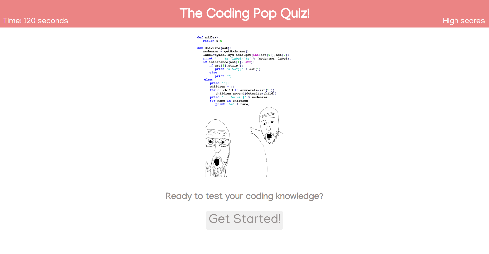

# 04-coding-quiz

## Description

The goal of this project was to create a timed quiz that would test the user's knowledge of coding. The quiz is timed, the quiz is generated with javascript by creating elements for the questions and answers, and the user is given a score based on how quickly they answer the questions. The user is also penalized minus 5 seconds for answering incorrectly. Upon submitting, the users score is saved to local storage and displayed on the high scores page. From there the user can restart the quiz and try again. The user can clear highscores from local storage through the developer console.

## Credits

[Manjari font from Google Fonts](https://fonts.google.com/specimen/Manjari?query=manjari)

Received help from my tutor Tudor Tocan, my bootcamp instructor Robbert, and Study group 4: The Dream Team.

## License

## Images

## Links

[Link to Github Repository](https://github.com/Gagucci/04-coding-quiz.git)

[Link to Deployed Webpage](https://gagucci.github.io/04-coding-quiz/)
